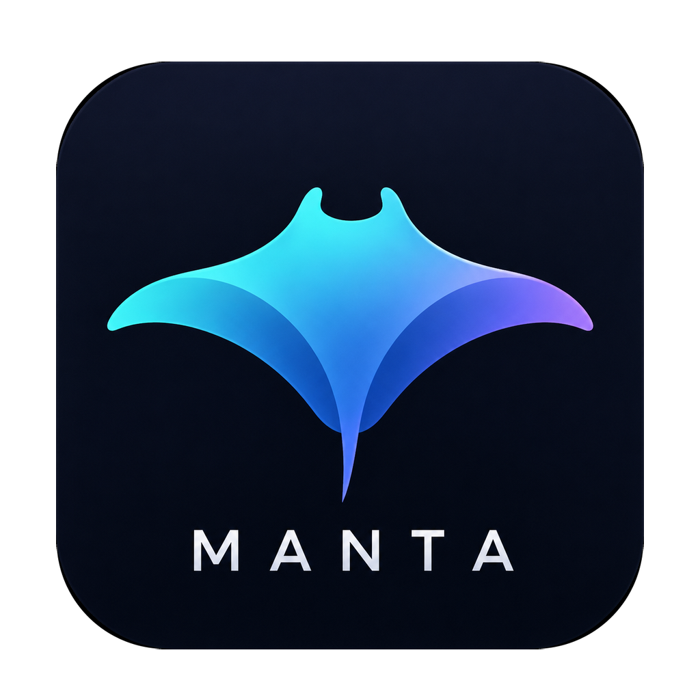

<h1 align="center">
  <a href="https://github.com/paidaxingyo666/Manta"></a> Manta
</h1>

<p align="center">
  <sub><a href="docs/readme/README.zh-CN.md">中文</a></sub>
</p>

<p align="center">
  
  
</p>

**Manta is a self-hosted fork of [Orca](https://github.com/stablyai/orca)** (MIT, © Lovecast Inc.).

Features:

- Self-host relay server
- No mandatory cloud account
- Internationalization
- Enterprise deployment

Based on: https://github.com/stablyai/orca

No standalone Manta release is published yet — build from source.

There is no Manta cloud service. Sign-in and relay stay off until you point them
at your own deployment (Settings → Advanced → Manta Cloud endpoints);
`relay-server/` is the server to run. Documentation links point at
`manta.sh.cn`, which is not a public service.

---

## Build from source

Requires Node 20+ and pnpm.

```bash
pnpm install
pnpm dev            # run the desktop app
pnpm build:mac      # or build:win / build:linux
```

The mobile companion lives in `mobile/` and is an Expo app:

```bash
cd mobile && pnpm install && npx expo run:ios   # or run:android
```

---

## Deploy the relay

The relay is what lets the phone reach a desktop that is not on the same
network. It is a separate deployable — the desktop only ever talks to it over
the network — and it is optional: on one LAN the phone pairs directly.

One relay serves several desktops. Each is identified by a hash of its own key,
so a phone paired to one cannot reach another.

### 1. Run the server

On a host with a domain pointing at it:

```bash
git clone https://github.com/paidaxingyo666/Manta /opt/manta
cd /opt/manta/relay-server/deploy
cp .env.example .env
$EDITOR .env
docker compose up -d
```

`.env` needs four values, all of them required — compose refuses to start
rather than fall back to something insecure:

| Variable | What it is |
| --- | --- |
| `RELAY_DOMAIN` | the domain Caddy gets a certificate for |
| `RELAY_PORT` | the public port; 443 unless it is unusable on that host |
| `MANTA_RELAY_ENROLLMENT_SECRET` | what a desktop presents to enrol; without it the endpoint is open to anyone who can reach it |
| `MANTA_RELAY_TOKEN_SECRET` | signs relay tokens; leave it empty and every restart invalidates the ones already issued |

Both secrets: `openssl rand -base64 32`.

Caddy terminates TLS and proxies to the relay, which is never published on the
host itself. The relay container runs unprivileged with a read-only root
filesystem.

**Prebuilt image, or build it yourself.** Left as it is, compose compiles the
checkout — which a small VPS takes minutes to do, and needs a toolchain the
host may not have. To pull a published image instead, set `RELAY_IMAGE` in
`.env`:

```bash
# Docker Hub
RELAY_IMAGE=paidaxingyo666/manta-relay:1.0.0

# Aliyun (Shanghai) — same image; one build pushes to both, so the digest matches
RELAY_IMAGE=crpi-b5cuqx1nkkudw599.cn-shanghai.personal.cr.aliyuncs.com/manta-relay/manta-relay:1.0.0
```

Both carry `linux/amd64` and `linux/arm64`; `docker pull` picks the right one.
Pin a version rather than `:latest` — a relay that changes underneath a restart
is a bad surprise.

Building from source stays the right answer when you are running an unreleased
commit, or would rather not take a binary someone else built.

To check an image before deploying it:

```bash
docker run --rm -p 8787:8787 \
  -e MANTA_RELAY_PUBLIC_URL=http://127.0.0.1:8787 \
  -e MANTA_RELAY_TOKEN_SECRET="$(openssl rand -base64 32)" \
  paidaxingyo666/manta-relay:1.0.0

curl localhost:8787/health
# {"ok":true,"version":"1.0.0","revision":"8dbee33…","builtAt":"2026-08-21T14:00:04Z"}
```

That is a smoke test, not a deployment — no enrolment secret and no TLS, so it
will not enrol anyone. Use compose for the real thing.

### 2. Point the desktop at it

Settings → Advanced → Manta Cloud → **Self-hosted server** → **Configure
endpoints**:

| Field | Value |
| --- | --- |
| Sign-in server | `https://relay.example.com` |
| Relay address | `https://relay.example.com` |
| OAuth client ID | `manta-desktop` |
| Enrolment secret | the value of `MANTA_RELAY_ENROLLMENT_SECRET` |

Include the port if the relay is not on 443. The origin is signed into every
host challenge byte for byte, so `https://host` and `https://host:9443` are
different identities and a mismatch fails the handshake.

Applying signs the app out and relaunches it — a session issued by one
deployment means nothing to another.

Repeat on each desktop. They share one enrolment secret.

### 3. Sign in to your account

Settings → **Manta Account** → email and password, or **Create one on this
relay**. Accounts live on your relay and nowhere else; the relay is the only
thing that ever sees the password.

Signing in to the same account from a second computer puts both in one place:
**Your machines** lists every desktop on the account, which is online now, and
when each was last seen. That is also what keeps a shared relay honest — a host
belongs to exactly one account from the moment it is claimed, and another
account asking for a token for it is refused.

Who may register is `MANTA_RELAY_ALLOW_REGISTRATION`; unset, it inherits the
enrolment secret, which is what a relay on the open internet wants. Signing in
with the enrolment secret alone still works and still lands on the account the
environment identity was adopted into — upgrading a relay that predates
accounts needs no configuration change, and a desktop that was paired under the
old identity moves itself onto your new account the first time you sign in.

### 4. Pair the phone

Settings → Mobile on the desktop shows a QR code. Scan it from the app.

**Full reference — configuration, TLS on a non-standard port, observability,
operating notes: [`relay-server/README.md`](relay-server/README.md).**

---

## Contributing

See [CONTRIBUTING.md](.github/CONTRIBUTING.md). Design and platform rules that
apply to every change are in [AGENTS.md](AGENTS.md).

## License

MIT — see [LICENSE](LICENSE). Upstream Orca's copyright is retained there
alongside this fork's.

Upstream Orca's [contributors](https://github.com/stablyai/orca/graphs/contributors)
wrote the code this builds on. Its [Discord](https://discord.gg/fzjDKHxv8Q) and
[@orca_build](https://x.com/orca_build) are upstream's, not this fork's — for
Manta, open an issue [here](https://github.com/paidaxingyo666/Manta/issues).
